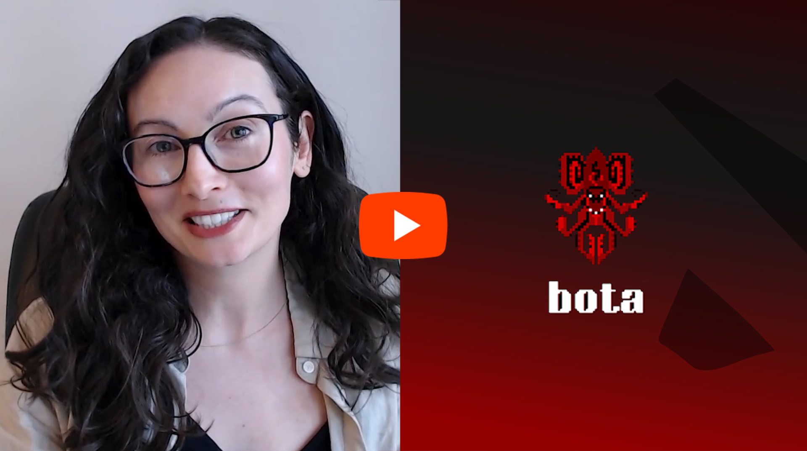
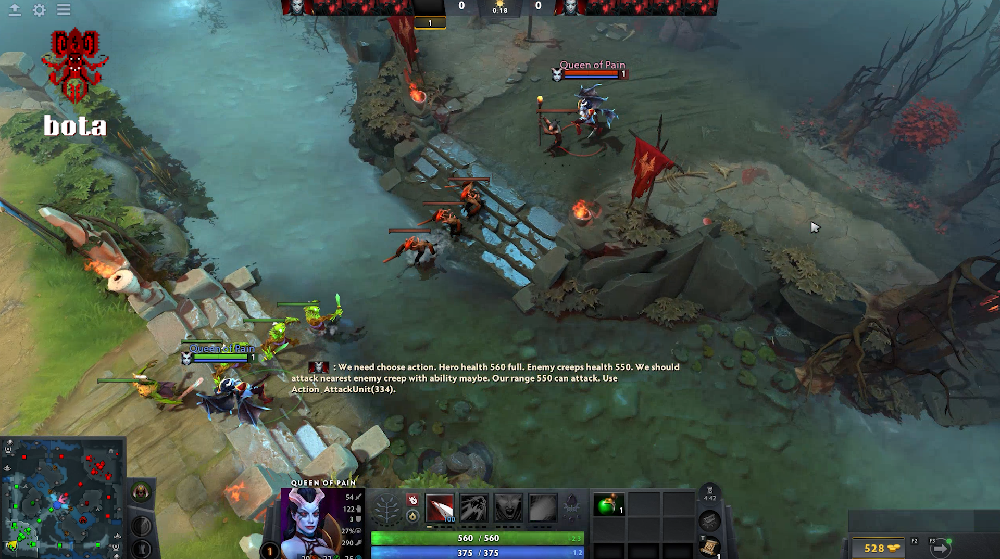
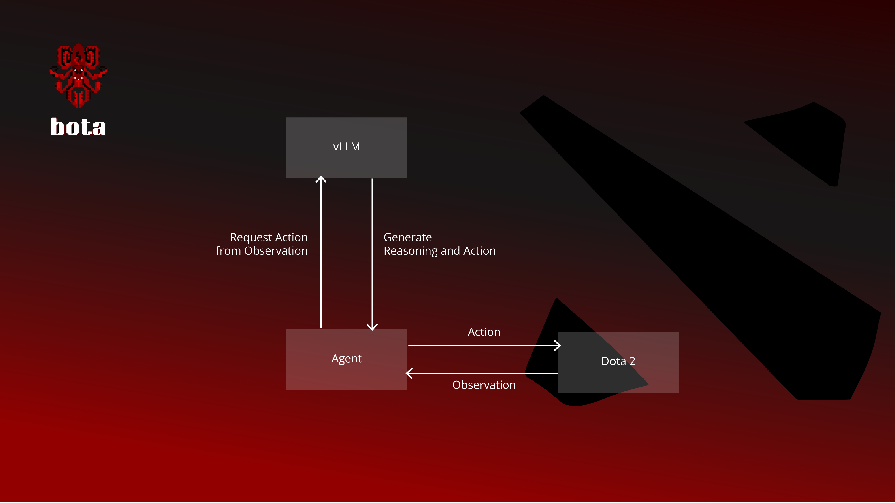

## Project summary

Bota is an autonomous Dota 2 agent that plays 1v1 Mid Lane, powered by GPT-OSS-20B and vLLM, and developed for the OpenAI Open Model Hackathon (https://openai.devpost.com/).

Our agent is written in Python and interacts with Dota 2 via 2 mechanisms: a socket to receive the observed game state and the LUA bot API to execute actions. We use the vLLM inference engine to run GPT-OSS-20B locally. The model is used without fine-tuning, in combination with a custom prompt to generate actions that the LUA bot API understands. The agent can move the hero, attack, use items as well as abilities.

[](https://youtu.be/XIzfuFHGIOI)

## Repository

```bash
├── assets
│   ├── architecture.png
│   ├── logo.png
│   └── video-thumbnail.png
├── bot_generic.lua
├── config.yaml
├── dota_sh.patch
├── dota_state.py
├── hero_selection.lua
├── LICENSE
├── protobuf
│   └── Makefile
├── README.md
├── requirements.txt
├── run_agent.py
├── run_dota2.py
└── utils.py
```

## Prerequisites

Bota has been developed on Ubuntu 22.04.4.

- Install Steam and Dota 2 (the game is free to play). Run the following command as sudoer:

```bash
apt-get install steam steamcmd
```

- You also need to install the Protocol Buffer compiler 30.2. Follow official instructions: https://protobuf.dev/installation/

- Install Python dependencies:

```bash
python3 -m venv venv
source venv/bin/activate
pip install -r requirements.txt
```

- Generate dota_gcmessages_common_bot_script_pb2.py and valveextensions_pb2 from latest dota_gcmessages_common_bot_script.proto:

```bash
cd protobuf
wget https://raw.githubusercontent.com/SteamDatabase/Protobufs/refs/heads/master/dota2/dota_gcmessages_common_bot_script.proto
wget https://raw.githubusercontent.com/SteamDatabase/Protobufs/refs/heads/master/dota2/valveextensions.proto
make
cd ..
cp protobuf/valveextensions_pb2.py  .
cp protobuf/dota_gcmessages_common_bot_script_pb2.py .
```

This will be used by run_agent.py to receive the game state from Dota 2.

If your Steam uses the default installation directory you don't need to modify config.yaml. If you use a custom SteamLibrary folder, modify the steam_library_path field accordingly.

## Run bota



Before running our scripts, make sure Dota 2 is up-to-date and that shaders are compiled. The best way to ensure this is to start the game normally and close it once you reach the main menu. Once done, you can use our scripts. We recommend switching the game to windowed mode so that the output of our scripts are easily visible while the game runs.

To run our agent, we first start vllm by running the following command in a terminal:

```bash
vllm serve openai/gpt-oss-20b --gpu-memory-utilization 0.7 --max_model_len 32768
```

Once "Application startup complete." appears vLLM is ready.

You can now launch run_dota2.py and run_agent.py from 2 different terminals. Both will automatically close on game end, but you can kill run_agent.py and restart it while a game is running. Note that run_dota2.py will add files into your Dota 2 installation directory, and removes them when it closes. These files shouldn't interfere with the game outside of the use of our agent.

```bash
python3 run_dota2.py
```

```bash
python3 run_agent.py
```

- run_dota2.py will start the game, skip the main loading screen, the main menu, and directly start a 1v1 mid lane game. It also skips hero selection. Once heroes appear open the console (default shortcut is "=") then type "kickid 5", press enter, then "jointeam 2" and press enter again. This will kick one of the dummy bot in the agent's team and make you join the agent's team, otherwise the fog of war won't allow to see anything. By running these 2 commands you join the game as a spectator in the team of the agent, which means the fog of war of the team is applied. We recommend to click on the agent hero at the top of the screen, so that you can see its statistics on the bottom, and then wait to the mid tower until the game starts (daytime - counter reaches 0 at the top).

- run_agent.py is the main script of our project. It orchestrates communications with the game and vLLM, including format conversions and error handling, and is summarized in section **Architecture**.

## Miscellaneous

- Reasoning: every time the agent makes a decision its reasoning appears on screen, in the chat box. It discusses its current state, including health, other units nearby,... and sometimes makes distance calculations.

- Configuration: we provide a default config.yaml to configure heroes in each team. Note that hero names start with "npc_dota_hero_" and the suffix is the name of the hero from the original DotA (e.g. Dota 2 Nature's Prophet is named "npc_dota_hero_furion"). Names are listed here: https://developer.valvesoftware.com/wiki/Dota_2_Workshop_Tools/Scripting/Built-In_Ability_Names

## Architecture



## The Team

- Amandine Flachs

- Alexandre Borghi

## License

Bota has an Apache 2.0 license, as found in the [LICENSE](LICENSE) file.
